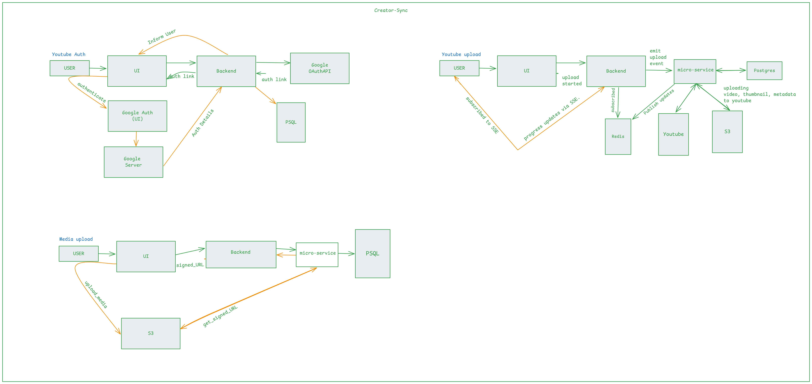

# Creator-Sync Documentation

**Creator-Sync** is a project I built to simplify collaboration between YouTube creators and video editors.

---

## Project Overview
The problem I wanted to solve is the lack of a dedicated workflow for creators and editors.  

Right now, collaboration happens across WhatsApp, Google Drive, and YouTube Studio, which makes it messy. Editors either need access to the creator’s YouTube account, or they upload drafts to cloud storage, forcing creators to manually download, review, and re-upload videos. This costs time and adds friction.  

**Creator-Sync** provides one platform where creators and editors can:
- Communicate via dedicated chat (text + media).
- Share drafts and feedback in one place.
- Upload and publish videos directly to YouTube once approved.

**Tech Stack**
- **React.js** for the frontend.  
- **NestJS** for the backend.  
- **AWS S3** for media storage.  
- **Google APIs** for authentication and YouTube integration.  
- **Redis** for managing state and background task progress.  
- **Server-Sent Events (SSE)** for real-time upload progress updates.  
- **Jest** for unit + integration testing.  

---

## Technical Details

### Architecture
The system is split into two main backend components:
1. **API Gateway** – handles REST API requests like signup, connecting with editors, and messaging.  
2. **Media Microservice** – dedicated to handling large media uploads to S3. Designed to scale independently.  

### Communication Patterns
- **Message-based** for operations where a response is needed (e.g., getting signed URLs).  
- **Event-driven** for fire-and-forget tasks (e.g., triggering background uploads).  
- **Redis pub/sub** is used to track and broadcast video upload progress.  

### Security and Efficiency
- Uses **signed URLs** with short expiration for secure uploads.  
- **OAuth with YouTube** ensures creators never share raw credentials.  
- Credentials are securely stored in the database.  

### Real-Time Updates
- **Redis** stores the state of ongoing uploads.  
- The backend pushes live progress updates to the client via **Server-Sent Events (SSE)**.  
- The frontend **subscribes to SSE** to display progress bars and retry options.  

### Scalability
- Microservice architecture allows independent scaling for heavy workloads.  
- Planned improvements: Dockerized deployment on AWS EC2, CI/CD pipelines via GitHub Actions, and CloudFront for global media delivery.  

### Testing
- **Jest** is used for unit and integration tests.  
- Focused especially on media handling, API reliability, and progress tracking.  

This architecture ensures smooth collaboration, secure integrations, and scalability for future growth.  

---

## Demonstration
Workflow example:
1. A creator and editor sign in and connect.  
2. The creator links their YouTube account securely via OAuth.  
3. They chat and exchange media. Media uploads go directly to **S3** using signed URLs.  
4. The editor submits a **video request** with title, description, thumbnail, and video.  
5. The creator reviews it, provides feedback, and once approved, the backend triggers the microservice to upload the video to YouTube.  
6. **Upload progress is tracked in Redis and pushed via SSE** to the frontend in real time.  
7. If an error occurs, uploads can be retried from the failure point.  

---

## Reflection
The biggest challenge was **efficient media handling** — ensuring large files could be uploaded, retried, and delivered securely.  
I also learned a lot about **microservice communication**, **real-time updates with Redis + SSE**, and **integrating with third-party APIs**.  

**Future Plans**
- Hosting with Docker on AWS with CI/CD.  
- Adding end-to-end chat encryption (similar to WhatsApp).  
- Using CloudFront for global media delivery.  

---

## Key Learnings
Through this project I gained hands-on experience in:
- Distributed systems design.  
- Secure API integrations.  
- Scalability with microservices.  
- Real-time communication with **Redis + SSE**.  
- Cloud infrastructure (AWS).  
- Automated testing (Jest).  

---

### [Video Preview](https://drive.google.com/file/d/1N7E1pv4iLQ0d-XFDWVoCeQScNSKqCsRE/view?usp=sharing)

### architecture
